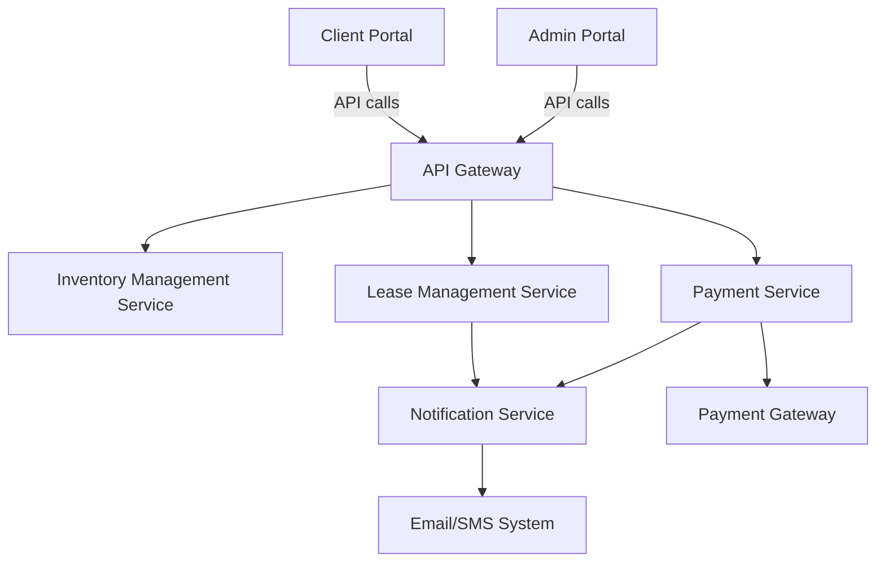

# Device Leasing System

## Context

I will be interviewing for a company that allows companies to offer the option to lease phone.
The lease amount is deducted from the employee's pre-tax income, hence also saving the employee $$ and ₹₹.
There are other benefits as well, but cost is a major factor for the target audience.

This is my attempt to design the backend of this system.

## Problem Statement
 Design a system that allows businesses to lease devices for their employees. The system should support features like:

* Managing device inventory (stock updates, lease tracking).
* Creating and managing leases for clients, including tracking durations.
* Supporting a portal for clients to view available devices, lease terms, and active leases.
* Handling payment processing, including recurring payments and failed payment retries.
* Ensuring scalability to handle multiple clients and large inventories.

## Requirements

### Definitions
- **client**: Companies who are using our product. Each company will have a dedicated store page for their organization.
- **admin**: Employees of our company - responsible for adding devices to global lists, and managing clients
- **employees**: Employees of the client company who can go to the company portal and lease a device from there.

### Functional Requirements:
- CRUD for managing all devices
- Lease creation and management
- User management and administration for clients, admins and employees
- Payment Management

### Non-Functional Requirements
- High performance, scalable and resilient
- Legal Compliance
- High availability

## Solution

### Overview

The Device Leasing System is designed to allow employees of our client companies to lease a device from us. 
The system comprises:
1. **Admin Portal**: Main admin portal of our system to onboard new users and manage existing ones.
2. **Client Portal**: Portal that is available to the admin on the client side to make changes to their company store only.
3. **Backend Services**: Microservices to handle the inventory management, payment and lease information.

I am not 100% sure about the Payment Gateway since it's a lease, but keeping it a placeholder.

### High Level Design

#### Components

- API Gateway: Single entry point to our backend. Handles rate-limiting, authentication and routing.
- Inventory Management Service: Manages device stock and availability
- Lease Management Service: Tracks lease creation, updates and associated metadata
- Payment Service: Responsible for managing payment - either from the employee or the client.
- Notification Service: Sending email/sms notifications for lease creation and updates, as well as reminders and other alerts.

### Low Level Design

#### Database Schema

- Device Table - maps each separate device to its current status
  - DeviceId (PK)
  - IMEI (SK)
  - DeviceCode (FK)
  - Status (Leased/Available/Maintenance)
  - LeaseInfo

- Devices Table - required to show the all devices listing page
  - DeviceCode (PK)
  - DeviceName
  - DeviceDescription
  - DeviceManufacturer
  - DevicePrice
  - DeviceStockCount
  - DeviceImages

- Lease table - stores data for each lease signed
  - LeaseId (PK)
  - DeviceId (FK)
  - ClientId (FK)
  - EmployeeId(FK)
  - LeaseStartDate
  - LeaseEndDate
  - LeaseStatus (Active/Inactive)

- Client Table
  - ClientId (PK)
  - ClientName
  - AdminEmail
  - Contact Number

- Employee Table
  - EmployeeId (PK)
  - EmployeeName
  - EmployeeEmail (SK)
  - ClientId (FK)

- Payments Table
  - PaymentId (PK)
  - LeaseId (SK)
  - Amount
  - Date
  - PaymentStatus (Success/Failure/Pending)

- Notifications Table
  - NotificationId (PK)
  - LeaseId (FK)
  - MessageContent
  - MessageType
  - SentAt
  - Status (Success/Failure)

### Scalability Considerations

- Database Partitioning: Due to the nature of data, we can partition the data per client for large set of employees.
- Message Queues: Use queues (RabbitMQ, SQS) for asynchronous operations like sending messages or payment retries.
- Multiple Servers: Loadbalancer, along with a autoscaling group
- Caching: using REDIS for frequently used data like device availability and popular devices pages.

### Authentication

Due to the nature of problem, the most appropriate form of login is OAuth 2. This way, we can be assured that the employee
is actually associated with a client company, and we would have all relevant information from the client directly.

## How everything works together

### Happy Path

Employee is looking to lease the new iPhone, which is in stock on our store.

The Employee logs into the store using their company email address. From the email address, we know which client store to display.
After going to the product page, the employee adds it to the cart and goes to the checkout page. Use then enters all relevant information.

Since there's no payment involved, the lease is created with **INIT** status. Simultaneously, a message is sent to the back-office team
to dispatch a phone to the client company office.

Once the back-office team confirms that the device has been successfully delivered, the lease is marked as ACTIVE.

> At the end of every set duration, a midnight CRON job runs that consolidates all the lease data per client company for 
> easier reconciliation.

### Unhappy Path - out of stock

Employee orders a new phone via lease. The phone was no longer in stock because of reporting error.
The back-office is then responsible for marking the lease as terminated.

## Frequently Asked Questions (FAQ's)

#### 1. How is the inventory managed?
Back-office has a portal where they can add new products and update existing ones.

#### 2. Can employee track their leases?
Yes, when employees sign in to the portal, they'll have a section called "My Leases" where they can view their past and current leases and their statuses.

