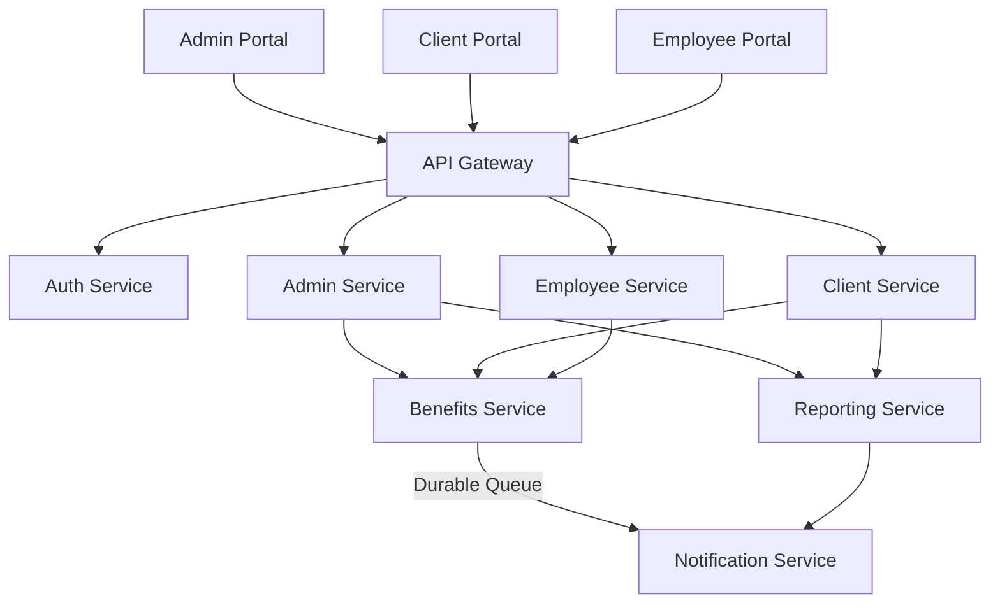

# Employee Benefit Platform

## Context

I am trying to build an Employee Benefits Platform that manages a set of employee benefits.
This is quite a problem because each benefit is a product on its own, and might and might not interact with other products.

## Problem Statement

We need to build a benefits platform that manages employee benefits. It includes
* Allow flexible allocation of benefits (e.g., health, wellness, devices).
* Ensure compliance with legal and company-specific policies.
* Provide real-time tracking and reporting for HR teams.
* Offer a seamless user experience for employees to view and manage their benefits.
* Scale for multiple companies and millions of employees using multi-tenancy architecture.

## Requirements

Since we need to support multi-tenancy, we need to define the following words:

- Admin: Our company admins who can make changes to the overall system.
- Client: Any company who is using our system.
- Client-Admin: The representative from the Client company using our system who is allowed to make changes to their respective company system only.
- Employee: An employee of the Client company. They are the ones who will receive the final benefits.

### Functional Requirements

- Portal for the Admin to enable/disable a type of benefits and its subtypes globally.
- Portal for the Clients to view/update benefits for their respective company. Each company can have their own set of benefits.
- The Client Portal should also create a consolidated report for all benefits by all employee for the company.
- Portal for the employee to log in and view existing benefits and get new benefits.

### Non Functional Requirements
- Highly Available, Highly performant, Resilient
- Scalable, must support several companies with millions of employees

## Solution

### Overview

This service is designed to allow employees of client companies to register for certain benefits offered by the company.

The system comprises:
- **Admin Portal:** Used by our company to manage clients, enable new features and settings.
- **Client Portal:** Used by clients to manage benefits offerings and view existing status.
- **Employee Portal:** Used by employee of the client application to manage benefits.

### High Level Design

#### Components

- **AuthService:** Responsible for logging the user into the system and giving them proper claims and roles.
- **AdminService**: Used to make global changes to the system by our company.
- **ClientService**: Used to make changes specific to one specific client for their company.
- **EmployeeService**: Used by individual employee to make changes to their benefits and user data.
- **BenefitsService**: Responsible for making changes to individual services. Also manages relationship between individual benefits, it any.
- **NotificationService**: Responsible for sending out notifications - text and email based on certain actions.
- **ReportingService**: Responsible for generating a variety of report for the Admins and Client Admins.

### Low Level Design

We will use OAuth 2.0 for logging in employees. For admins, we will use username and passwords.

#### Database Schema

- Benefits Table
  - BenefitId (PK)
  - Description
  - Metadata

- Client Table
  - ClientId (PK)
  - ClientName
  - AdminEmail
  - Domain (SK)
  - ContactNumber

- ClientBenefit Table
  - ClientBenefitId (PK)
  - DateOfRegistration
  - Status (Active/Inactive)
  - ClientId (FK)
  - BenefitId (FK)

- Employee Table
  - EmployeeId (PK)
  - EmployeeName
  - ClientId (FK)
  - EmployeeEmail (SK)

- EmployeeBenefitAllocations Table
  - AllocationId (PK)
  - EmployeeId (FK)
  - ClientId (FK)
  - AllocationMetadata
  - LastUpdatedAt

- Notifications Table
  - notificationId (PK)
  - Origination_BenefitId (FK)
  - Content
  - Type (Email/Message,etc.)
  - SentAt 
  - Status (Success/Failure)

- Audit Table
  - LogId (PK)
  - UserId (FK)
  - UserType ("Admin", "Client", "Employee")
  - EntityType ("Client", "Policy", "Benefit")
  - Action ("CREATE", "EDIT", "DELETE")
  - CreatedAt

### Scalability Considerations

- **Data Partitioning:** Due to nature of data, we can partition the data per client for a large set of employees.
Partition Employee and Benefits tables by ClientId to reduce the size of individual partitions.
- **Message Queues:** Using queues like RabbitMQ for asynchronous operations like sending notifications. Also offload heavy
tasks like report generation to a separate service that will send a message/email when complete.

## How everything works

### Happy Path - Onboarding a new client

Our company admin can onboard a new company. This makes an entry in the Client table.
Further, we need to add a list of all employees for that company as well their email addresses into our system.

### Happy Path - Employee wants to add a new benefit

Whenever an employee of the said company logs in, we match their email address with the domain/exact email address.
This way we know the client.
A home page is shown based on the preference set by the client.

The employee can then configure any benefit from the list. Once selected and confirmed, an entry is made into the EmployeeBenefitAllocations table.
