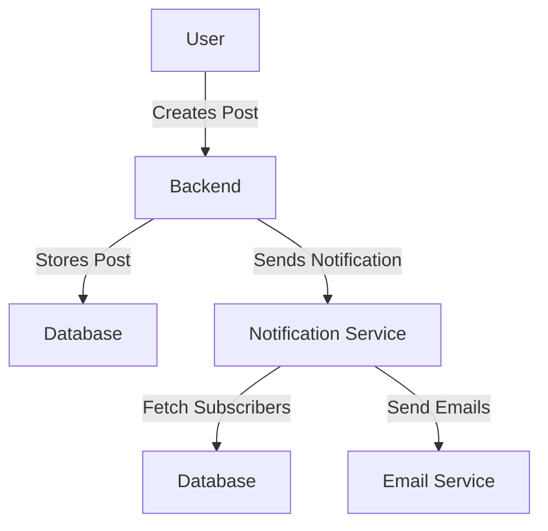

# Notification System for Blogging Website

## Context
I recently had an interview with a company, where I was asked this question about System Design. It didn't go great, and I realized I need to practice giving interviews.
The chief problem was communication - I found it hard to convert my thoughts into coherent sentences. 
I was speaking ALL of my thoughts aloud, which only added to the interviewer's confusion.

From the interviewer's side, he gave me ample hints but the conversation didn't go as well as either of us had hoped for.

This is my second attempt at the same System Design problem to understand how I could have done better.

## Problem Statement

We have to design a website like Medium with emphasis on posting an article.

In the second part, we need to augment this system to handle notifications.
Users can subscribe to authors such that whenever an author posts, all the subscribers should get an notification.
For simplicity, we'll only consider an email notification.

### Requirements

The first step was to gather the requirements for the first half. Based on our conversation, they were:

- Ability to publish a blog post
- View it publicly
- ~~Edit only by author~~
- ~~View only after publish~~
- ~~Ability to save it as a draft~~

For simplicity, we'll consider the simple model of making a post and saving it in the database. 

The second part had these requirements:

- Sending email notifications to all subscribers
    - This isn't realtime, the process can take a while
    - Every subscriber must get an email for every post
    - The system needs to be resilient to failures. If a system breaks in between sending a large of emails, it should continue from where it left.

---

## Solution

### Overview
We will design a simple blog posting system first and then augment it with a notification system.

### High Level Design

### Low Level Design

**Blog Posting**
* Front-end to create and publish blog posts.
* Backend to handle the creation and storage of posts.
* Database to store the blog posts.

**Notification System**
* Subscription Service to allow users to subscribe to authors.
* Notification Service to handle the sending of notifications.
* Email Service to send the actual email notifications. Add retry mechanism here.

### Database Design
For simplicity, we can use a SQL DB which will handle:

* User data
* Blog posts
* Subscriptions

### Storing and Fetching Author-Subscriber Data
#### Storing Data
The subscription data is stored in the **_Subscriptions_** table with the following columns:

* id: PK
* subscriber_id: FK referencing the **_Users_** table
* author_id: FK referencing the **_Users_** table

When a user subscribes to an author, an entry is inserted into the **_Subscriptions_** table with the userId and the authorId.

#### Fetching Data
To fetch the list of subscribers for an author, a query is made to the Subscriptions table to retrieve all rows where _author_id_ matches the ID of the author. 
The _subscriber_id_ from these rows are then used to get the email addresses of the subscribers from the Users table.

> [!TIP]
> I have used the words author_id and subscriber_id quite loosely. 
> Both author and subscriber are essentially users and not mutually exclusive.
> These exist here to distinguish between the two.

#### Handling Large Number of Subscribers
In cases where an author has millions of subscribers, fetching and sending notification might overload our system. To handle this efficiently:

- Batch Processing: Break down the subscriber list into smaller batches and process each batch separately.
- Message Queue: Use Kafka or RabbitMQ to handle the distribution of email notifications. Each batch of emails can be pushed to the queue and processed asynchronously.

> [!TIP]
> Using a Queue also solve the problem that happens in case the system breaks down in middle of the problem,
> and lets us continue from the point it failed - something we talked about during our call.

### Caching
Avoid this for now to keep the design simple.
Further, during the design phase, we realized we don't really need this.

### Database Design

1. Users: id, name, email
2. Posts: id, author_id, title, content, created_at
3. Subscriptions: id, subscriber_id, author_id

---

## Request Processing Flow

### 1. Happy Path - making a post

- **Steps**:
  - User creates and submits a post through the UI. 
  - Backend service receives the request and stores the post in the database.
- **Outcome**: The request is processed immediately and successfully.

### 2. Happy Path - sending notifications to subscribers

- **Steps**:
  - After the post is saved, the backend triggers the notification service. 
  - Notification service fetches the subscribers from the database. 
  - Notification service sends emails to all subscribers using the email service.
- **Outcome**: An email is sent to all the subscribers

### 3. Some error occurred while sending notifications

- **Steps**:
  - Notification service encounters an error while sending emails. 
  - The system logs the error and retries sending the emails.
- **Outcome**: The notification is delayed but eventually sent to all subscribers

### 4. Notification Service runs on a single server and has crashed.

- **Steps**:
  - Entire Notification service has crashed. New server spins up to take its place when X health checks fail.
  - The server connects with the messaging queue and starts fetching the unprocessed notifications.
  - The processing starts exactly at the last processed message.
- **Outcome**: The notification works as intended.

---

## Follow ups

#### **1. What if sending notification server crashes while sending the notifications? How do we continue from where it left off**
Using a message queue solves these issues by enabling asynchronous processing of notifications.
If the server crashes while sending notifications, the messages remain in the queue and can be processed later.
This ensures that notifications are eventually sent without duplicating efforts. 
It also supports retry mechanisms and batch processing for efficient handling of large subscriber lists.
