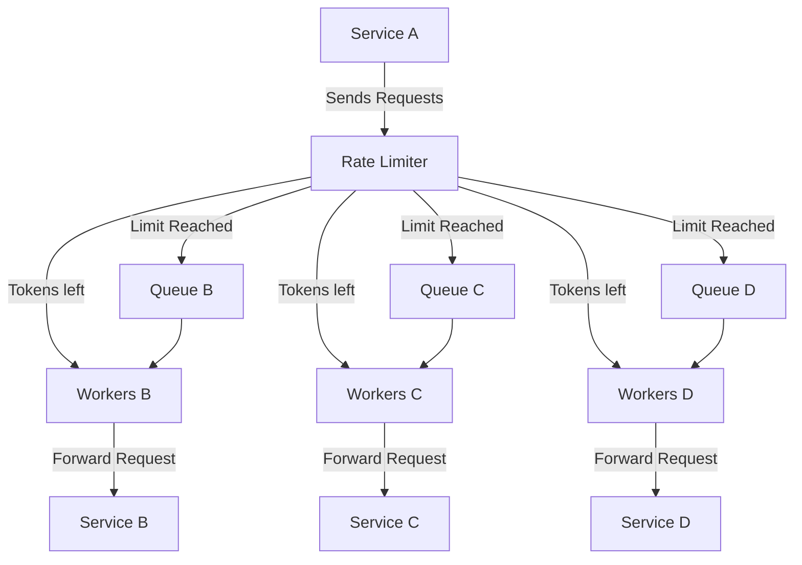
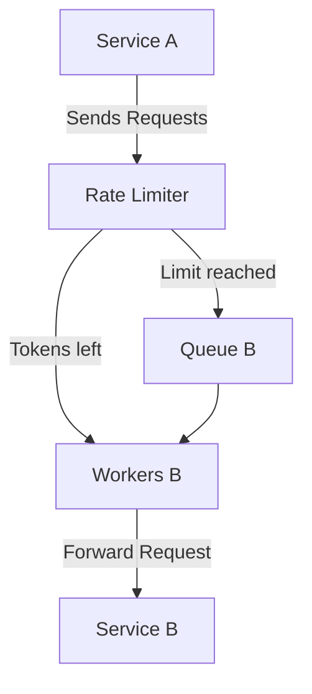

# Rate Limiting Service Design

## Context

I recently participated in a high-level design interview for Loop AI, where I was asked to design a rate limiting service. 
Despite having studied different rate limiting approaches just a week prior, I found myself drawing a blank during the interview. 
The interviewer was quite supportive, providing hints and guiding the conversation forward, but I struggled to process the information in the moment.

This README is my attempt to revisit and solve the problem the same problem from during the interview.

---

## Problem Statement

### Scenario

- **Service A** needs to call **Service B**, **Service C**, and **Service D** to process data.
- The calls to **Service B**, **Service C**, and **Service D** are **independent** of each other and should be handled **asynchronously**.

### Rate Limits

- **Service B**: Can handle **100 requests per hour**.
- **Service C**: Can handle **3,000 requests per hour**.
- **Service D**: Can handle **10,000 requests per second**.

---

## Requirements
The first step to solve this is to gather all the requirements. From our conversation, we were able to get to these:

1. **Rate Limiting Enforcement**: 
Ensure that requests to each downstream service do not exceed their specified rate limits.
2. **Asynchronous Processing**: 
Service B,C and D are not dependent on each other or sequence of execution can be anything.
3. **No Request Dropping**: 
All requests that are rate-limited must still be processed eventually; none can be discarded.
4. **Failure Handling**: 
If processing fails for a request, implement a retry mechanism.
5. **Scalability and Reliability**: 
The system should scale to handle high throughput and be resilient to failures.

---

## Solution

### Overview

We need to design a rate limiting service that sits between Service A and the downstream services (B, C, D). 
This service will manage the rate at which requests are sent to each downstream service, ensuring respective rate limits, and handle retries in case of failures.

### High-Level Architecture

> [!TIP]
> This might seems like a lot of components, but don't worry - it's actually quite simple. 
> We'll talk about each component in a bit, and focus solely on Service B going forward. 

### Components
1. **Rate Limiter**: Determines whether to send a request immediately or put it in the queue.

2. **Queues**: Separate durable message queues for Services B, C, and D to hold rate-limited requests.

3. **Workers**: Dedicated worker pools for each service that process requests from their respective queues.

### Detailed Description

In order to understand the working, we'll simplify our model to exclude Service C and Service D.

## Detailed Design

### 1. Rate Limiter

- **Function**: Acts as the entry point for requests from Service A. It checks if the request can be processed immediately or needs to be queued.
- **Implementation**:
    - Uses a **Token Bucket Algorithm** for each downstream service.
    - **Token Replenishment**:
        - **Service B**: 100 tokens/hour ⇒ 1 token every **36 seconds**.
        - **Service C**: 3,000 tokens/hour ⇒ 1 token every **1.2 seconds**.
        - **Service D**: 10,000 tokens/second ⇒ Tokens replenished every **0.1 milliseconds**.

### 2. Queues

- **Purpose**: Store requests that cannot be processed immediately due to rate limits.
- **Characteristics**:
    - **Durable**: Persist requests to prevent loss in case of failures.
    - **FIFO Order**: Ensures fairness in processing.
- **Technology Options**: Kafka, RabbitMQ, AWS SQS

### 3. Workers

- **Function**: Dequeue requests and send them to the respective downstream services while respecting rate limits.
- **Behavior**:
    - Poll the queue and check for available tokens before sending a request.
    - Implement retry logic for failed requests.

### 4. Token Bucket Algorithm

- **Process**:
    1. Each service has a bucket with a maximum capacity equal to its rate limit.
    2. Tokens are added to the bucket at a steady rate.
    3. Before a request is processed, a token is removed from the bucket.
    4. If no tokens are available, the request is enqueued.

### 5. Retry Mechanism

- **Handling Failures**:
    - On failure, the request is retried after a delay using an **exponential backoff strategy**.
    - **Maximum Retries**: Configurable limit (e.g., 3 attempts).
- **Dead-Letter Queue (DLQ)**:
    - Failed requests exceeding maximum retries are moved to a DLQ.
    - DLQ can be monitored, and messages sent to Slack because this requires immediate attention.

---

## Request Processing Flow

### 1. Happy Path

- **Steps**:
    1. Service A sends a request to the Rate Limiter for Service B.
    2. Rate Limiter checks the token bucket for Service B.
    3. Tokens are available (bucket not empty).
    4. A token is consumed, and the request is forwarded to Service B via the worker.
    5. Service B processes the request successfully.
- **Outcome**: The request is processed immediately and successfully.

### 2. Bucket Runs Out of Tokens

- **Steps**:
    1. Service A sends a request to the Rate Limiter for Service B.
    2. Rate Limiter checks the token bucket for Service B.
    3. No tokens are available (bucket is empty).
    4. The request is placed into Queue B.
    5. Tokens are replenished over time (1 token every **36 seconds**).
    6. Workers monitor the queue and the token bucket constantly.
    7. When a token becomes available, a worker dequeues a request, consumes a token, and sends it to Service B.
- **Outcome**: The request is delayed but eventually processed.

### 3. Processing Fails for a Request

- **Steps**:
    1. A worker sends a request from Queue B to Service B.
    2. Service B fails to process the request (e.g., due to a timeout or error).
    3. The worker implements the retry mechanism:
        - Put back the request in the queue with an reduced counter for number_of_retries_left.
    4. If the maximum number of retries becomes 0:
        - The request is moved to the Dead-Letter Queue (DLQ).
        - Slack Notification
- **Outcome**: The system handles transient failures gracefully and isolates persistent failures for further analysis.

---

## Follow-ups: Frequently Asked Questions

### **1. How does the worker talk to the Rate Limiter?**

We use **Redis** to store the current token bucket counter value for each service. Redis is well-suited for this purpose because:

- **Single-threaded**: Redis ensures atomicity for operations like `DECR` (decrement) and `INCR` (increment), which are critical for maintaining accurate rate-limiting logic.
- **Minimal data requirements**: Each service only needs a small amount of metadata (e.g., current token count, last replenishment time), which Redis can handle efficiently.

If Redis is not preferred, other distributed data stores like Memcached or in-memory databases can also work.

---

### **2. Can workers directly manage rate-limiting logic without the centralized Rate Limiter?**

Yes, workers can manage rate limits independently in certain scenarios:

- Workers maintain their own token bucket state.
- **Trade-offs**:
    - Reduces reliance on a centralized system.
    - May introduce slight inconsistencies in token usage during sync intervals, especially in high-throughput environments.

For most cases, a shared token store like Redis strikes a better balance between consistency and scalability.
